# Session 2 — VS Code with Copilot on Biowulf / Git & GitHub

**AI Tools and Best Practices for Researchers — CCR Genetics Branch**


Contacts: Vineela Gangalapudi (vineela.gangalapudi@nih.gov) · Erica Pehrsson (erica.pehrsson@nih.gov)

---

During this session, we will teach you how to
- Access VS Code on Biowulf, allowing you to work with large datasets and powerful computational resources
- Use Git/GitHub to download a public repository 
- Run a differential gene expression analysis on a counts table on Biowulf
- Use AI to create custom scripts and git to add them to your repo

---

## Preliminary setup

- [ ] GitHub account with Copilot enabled
- [ ] Biowulf account, unlocked ([user dashboard](https://hpcnihapps.cit.nih.gov/auth/dashboard/))
- [ ] Biowulf data directory mounted to local machine ([instructions](https://hpc.nih.gov/docs/hpcdrive.html))
- [ ] Able to access Biowulf login node via terminal
- [ ] On the NIH network or VPN
- [ ] Basic familiarity with git and Github

## Part 1 — Launch VS Code on HPC OnDemand

Go to **<https://hpcondemand.nih.gov/>**

Sign in with your PIV card or MFA app. On the left sidebar, you'll see the list of **Interactive Apps, GUIs, and Servers** available on Biowulf. Scroll down to **VSCode** and click it.

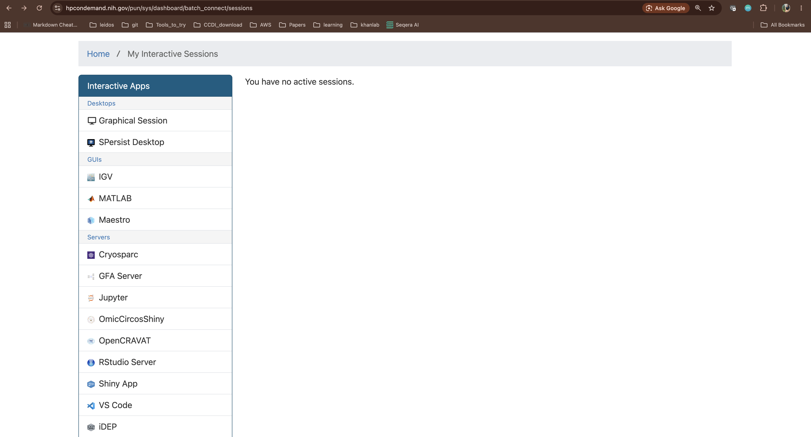

This brings up a launch form with requested resources (e.g., time, CPUs, memory). Keep the defaults for this session. Click **Launch**.

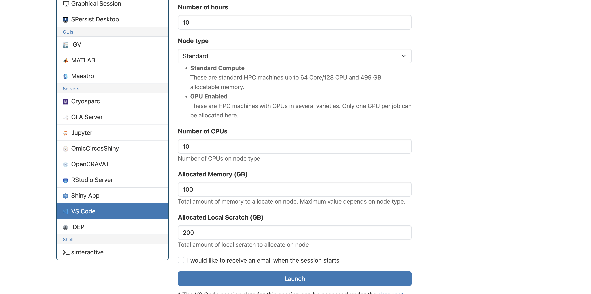

This launches an interactive Biowulf session. Your session will go into the Slurm queue. It usually takes a few minutes to become available.

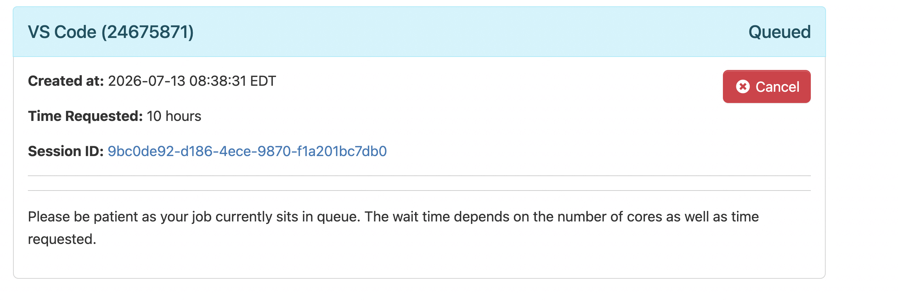

> ⚠️ This job counts against your limit of 2 simultaneous interactive jobs. If you already have multiple `sinteractive` sessions running, close them first or your launch will fail.

When the card turns green and says **Running**, your session is ready. Click **Connect to VS Code**.

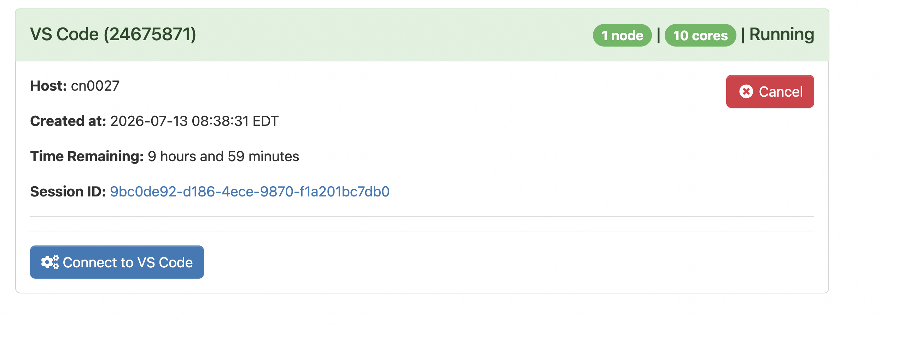

## Part 2 — Open your Biowulf data directory

The VS Code instance that opens in your browser has a nearly identical layout to the VS Code desktop app we installed in Session 1.

By default, VS Code launches in your home directory, which is very small. You will typically work in your personal data directory (```/data/<username>```). There, each user is assigned 10G by default, and additional space can be requested if needed.

Click **Open Folder** (also accessible via three lines in upper left > File > Open Folder). 

In the search bar at the top, type the path to your data directory (```/data/<your-username>```). For example, Vineela's is `/data/gangalapudiv2`. If you don't know your username, check your [profile](https://hpcnihapps.cit.nih.gov/auth/dashboard/). 

Click **OK**. You'll see a popup asking whether you trust the authors of the files in this folder:

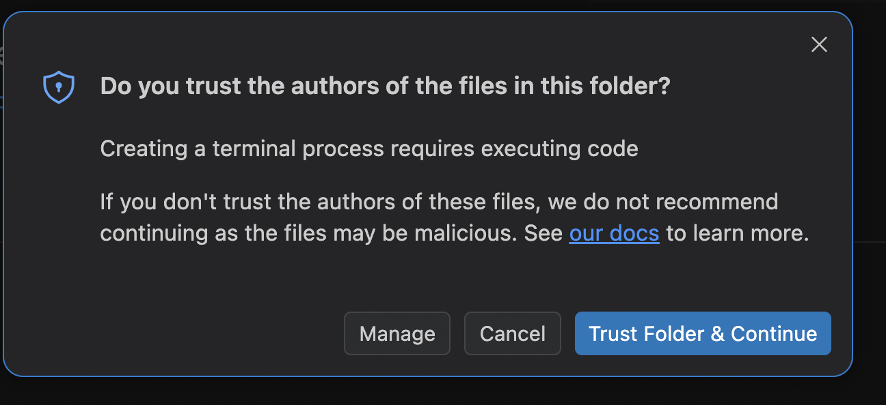

This is a normal VS Code safety prompt — it's asking because VS Code can execute code from a workspace. Since this is your own directory, it's safe to click **"Yes, I trust the authors"**.

## Part 3 — Sign in to Copilot

In the bottom right, select the Copilot symbol. Sign in to GitHub following the provided instructions.

## Part 4 — Set up the project workspace

In the Explorer panel, hover over your directory and select **New Folder**. Create a new folder for this analysis. We recommend always creating a separate subdirectory for each project. 

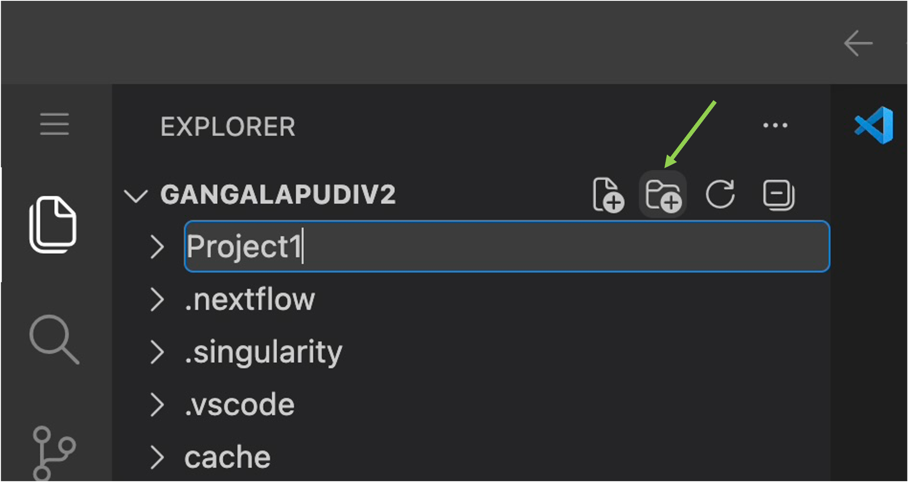

Open a terminal within VS Code by selecting three lines > Terminal > New Terminal. Change directory into your project subfolder.

```bash
cd <project subfolder>
```

## Part 5 — Get the class repo from GitHub

For this session, you will be downloading a public repo. 

### 5a. Fork the repo

Forking a repo provides you a copy where you can experiment without affecting the main repo. 

In your browser, go to <https://github.com/CCRGeneticsBranch/AI_training_session2>. In the upper right, click on **Fork**. Ensure the new owner is your personal GitHub username and keep the original repo name. Then select **Create fork**.

<p align="center">
	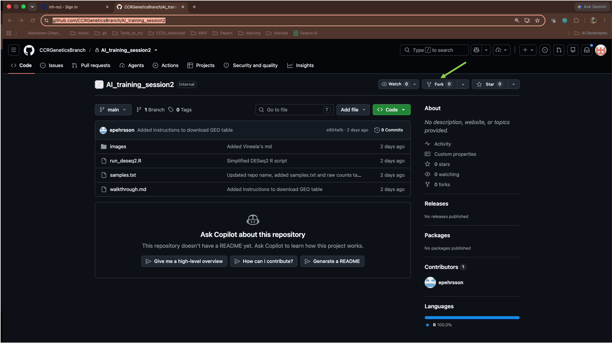
	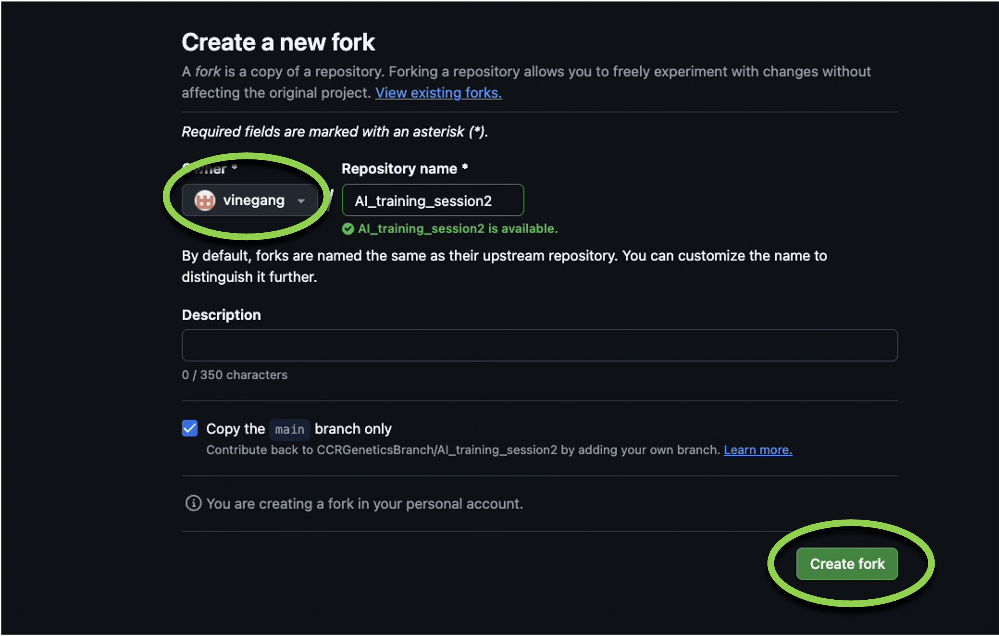
</p>

### 5b. Generate a personal access token (PAT)

Instead of authenticating with your password, you will generate a PAT for GitHub. Follow [these instructions](https://docs.github.com/en/authentication/keeping-your-account-and-data-secure/managing-your-personal-access-tokens#creating-a-fine-grained-personal-access-token) to generate a fine-grained PAT. Enter the token name, make sure the Resource owner is your personal username, increase the Expiration to 90 days, select "Only select repositories" - your forked repo, and under "Add permissions", select "Contents" - "Access: Read and write", "Metadata", "Workflows" - "Access: Read and write". Click **Generate token**. Be sure to copy the token and keep it somewhere safe, as you would a password. 

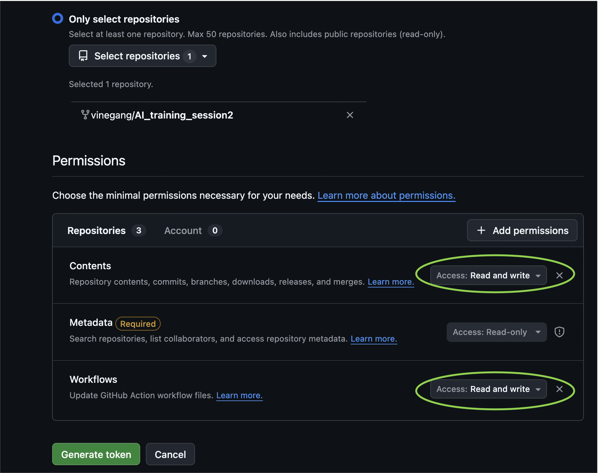

### 5c. Open a terminal with the Biowulf login node

Because VS Code is running within an interactive session, you will not be able to push to remote GitHub repos within the interface. Access the Biowulf login node via a separate terminal using these instructions:

Windows: search for the PowerShell  app.

Mac: look for the Terminal 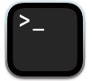 app.

Open these apps, and in the terminal type:

```bash
ssh <your-username>@biowulf.nih.gov
```
For example, ```ssh gangalapudiv2@biowulf.nih.gov```

Once there, change directory (cd) to your data directory (for example, ```/data/gangalapudiv2/Project1```). 

```bash
cd /data/<your-username>/<project-subfolder> 
```

You are now "sitting" in the same location in your login node terminal and your VS Code terminal. You can confirm this with a "print working directory" statement:

```bash
pwd
```

### 5d. Clone your fork to Biowulf

In your browser, navigate to your forked repo (```https://github.com/<username>/AI_training_session2```).

Click on the green **Code** button. Make sure HTTPS is highlighted, then copy the web URL. 

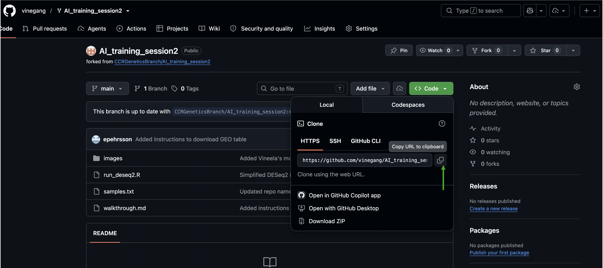

Within your login terminal, run:

```bash
git clone <copied address>
```

You now have a local copy of the repository on Biowulf. 

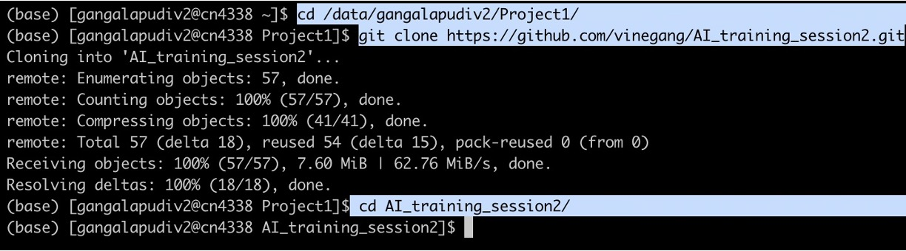

Change directory into the repo. 

```bash
cd AI_training_session2
```

## Part 6 — Perform the DESeq2 analysis

Back in VS Code, change directory into the cloned repo in your terminal and look through it using the Explorer panel. It contains:

- A sample table listing 6 samples and their conditions.
- An R script to perform a DESeq2 analysis on a raw counts table.

We will need to download the RNAseq count table separately. This file was generated by RSEM as part of [Ebegboni et al](https://pubmed.ncbi.nlm.nih.gov/38588446/) and is archived in [GEO](https://www.ncbi.nlm.nih.gov/geo/query/acc.cgi?acc=GSE243183). In your VS Code terminal, download the counts file.

```bash
wget https://ftp.ncbi.nlm.nih.gov/geo/series/GSE243nnn/GSE243183/suppl/GSE243183%5FTC%2D32%5FRawCountFile%5FRSEM%5Fgenes%2Etxt%2Egz
```
Unzip the file.

```bash
gunzip GSE243183_TC-32_RawCountFile_RSEM_genes.txt.gz
```

Examine the first few rows. Each row is a gene, each column is a sample, and each cell is a read count. 

Load R. Unlike on your local machine, the Biowulf staff have already installed R. You only need to load the software using the ```module load``` statement.

```bash
module load R 
```

Review the R script to make sure you understand it, then run it. 

```bash
Rscript run_deseq2.R
```
The script will run, producing many lines of output. After it finishes, you will see a new file (DESeq2_results.tsv) with the DESeq2 results. You can inspect it in the Explorer. 

## Part 7 — Create new scripts with Copilot

As in Session 1, you can use Copilot to add new scripts to your repo. In the Copilot chat, ask the agent to write a new R script in the AI_training_session2 repo that will create a volcano plot from the DESeq2_results.tsv file. You should still review any proposed commands before running them and review the script line-by-line before running it. Once you are statisfied, you can ask Copilot to run the script.  

### 7a. Commit your changes

In your separate login terminal, commit your new script to the repo. First, look at the status of your repo.

```bash
git status
```

This will print the branch you are on and a list of files that were changed in the repo directory.

Alternatively, in VS Code, you can select the version control panel (flowchart with 3 nodes). This will show all files that were changed since your last commit. 

You can inspect the exact changes with the command:

```bash
git diff
```

Alternatively, in VS Code, select the name of a file to view exact changes. 

Stage a file for commit:

```bash
git add <file>
```

Alternatively, in VS Code, select the "+" next to the file. **BE CAREFUL!!** In the VS Code interface, this button is perilously close to the "Discard Changes" back arrow - which will reverse your edits!

The interface and ```git status``` will now show the file as staged. 

Now commit your changes. 

```bash
git commit -m "<summary of changes>"
```

Alternatively, in the interface, type your summary message and select **Commit**. 

### 7b. Push your changes to GitHub

You will now push your changes to GitHub. In your login terminal, run:

```bash
git push
```

When prompted, enter your GitHub username and PAT, as in [these instructions](https://docs.github.com/en/authentication/keeping-your-account-and-data-secure/managing-your-personal-access-tokens#using-a-personal-access-token-on-the-command-line).

You will see a confirmation that your results have been pushed to the remote. 

Now return to the repo in your browser. In the grey bar under **Code**, you will see that a commit was just pushed. Next to your username, click on the summary message. This will show you a visual overview of the exact changes that were made. 

There are many advantages to using git to version control your code. Especially when iterating with AI, it protects your code from accidental deletion or destructive editing. And it allows multiple people to collaborate on the same code base at once by tracking changes and providing a framework to reconcile them. 

Continue inspecting the results and iterating with AI, committing your changes as you go. 

### 7c. Ignoring files in a repo

Code, configs, and small reference files can be tracked with git. **Do not track PII, passwords, or large datasets**. Once a file is committed, it will be recorded in the git history even if you delete the file.

As protection, you can use a `.gitignore` file, which may contain something like:

```
*.bam
*.fastq.gz
*.cram
results/
```

This file specifies files that should not be tracked in the repo.

## Future directions

On Biowulf, it is possible to download fastq files directly from HPC DME and perform an end-to-end analysis, including preprocessing, QC, generating a count matrix, performing a differential expression analysis, and plotting the results. Please reach out if you would like to learn how to run the entire process!
